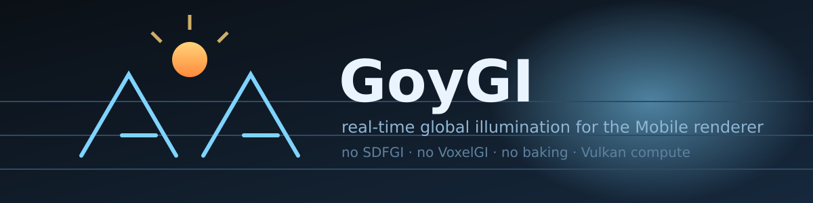
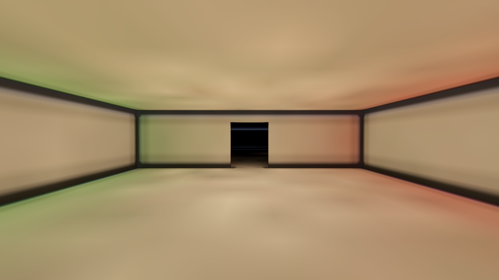
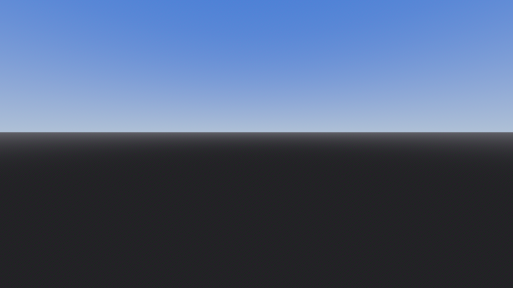
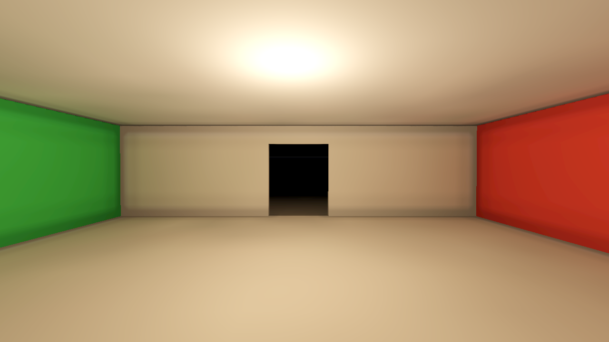
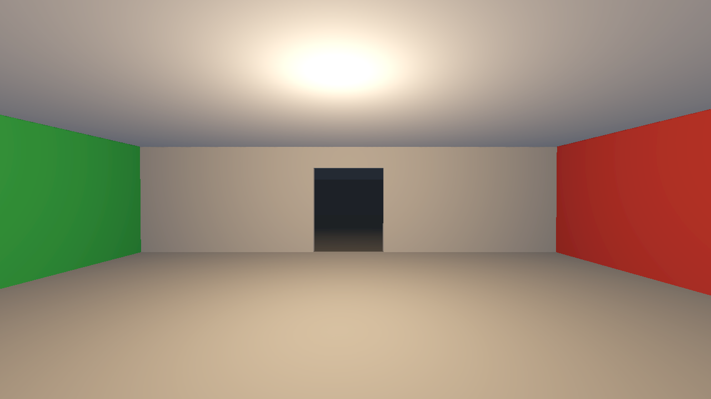
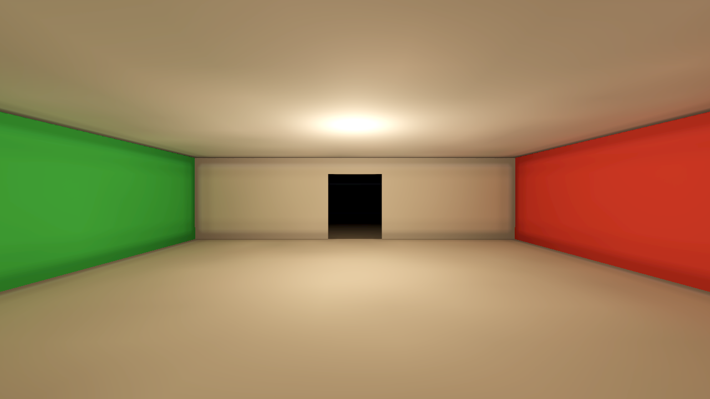
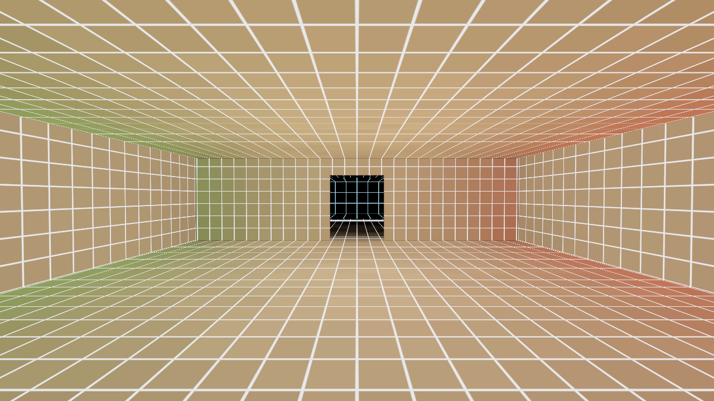

# GoyGI

[](https://github.com/GoyDevv/GoyGI-Godot/actions/workflows/ci.yml)
[](LICENSE)


**Real-time global illumination for the Godot **Mobile** renderer. No SDFGI, no VoxelGI, no lightmap baking, no phone-specific build — bounce light, sky light and colour bleeding, live in the editor and at runtime on a Vulkan 1.1 phone.**

<p align="center">
  
</p>

## What it looks like

All of the images below are rendered **by CI** on the Mobile renderer (software Vulkan, no GPU) every push — not by hand, not on a phone. `docs/screenshots/summary.txt` is the report they came with.

| indirect light only (`debug_view = GI Only`) | bounce through a doorway into the second room |
|---|---|
|  |  |
| **wall close-up** (the old "pure boxes" case) | **GI switched off** — still plain-Godot lit |
|  |  |
| **beauty shot** | **voxel debug view** |
|  |  |

`SDFGI` and `VoxelGI` are **Forward+ only**. On `Mobile` (and on `Compatibility`) Godot gives you direct light, a sky, an ambient term and reflection probes — and nothing that moves light from a lamp to the wall next to it. GoyGI adds that missing piece as a plugin: an irradiance volume plus a world-space light cache, both computed in Vulkan compute shaders, both real-time.

| | |
|---|---|
| **Renderer** | Vulkan 1.1 / `--rendering-method mobile` (`Forward+` also works, `Compatibility` runs with the GI switched off) |
| **Cost** | 3 texture fetches per pixel for the indirect light, 1–2 occupancy taps for leak protection; the GI itself runs at 5–60 Hz in the background |
| **Baking** | none. Sky, sun, lamps, torches and moving objects are all evaluated at run time |
| **Editor** | live preview in the 3D viewport (toolbar button `GoyGI`) |
| **Godot** | 4.7+ (CI builds and renders on **4.7.2**) |

```
GoyGI - Godot  ·  "An godot plugin for android mobile renderer, no need for SDFGI anymore, Use GoyGI"
```

---

## Fixed in 3.1

Everything below was found by reading the maths, not by tuning knobs, and every one of them has a check in the CI test so it cannot come back.

* **Voxels showed up as hard blocks on walls.** The sampler used to *move the sample point* towards the visible voxels: that offset is a discontinuous function of the surface position, so the hardware trilinear blend flipped between two voxel neighbourhoods at every cell boundary. Replaced with plain trilinear + a continuous occupancy leak guard — see [§11](#11-why-the-voxel-grid-used-to-show-up-as-boxes). Same fix removed the remaining light leaks around corners.
* **"Missing chunks" / areas of the map going dark.** The per-chunk fade-in target was `passes / 3`, so a chunk that was recomputed (lamp switched, sun moved, geometry edited) dimmed to a third — or, when its pass counter was reset, to black. The fade now only goes up: a chunk that has been computed once keeps its light while it is blended to the new one.
* **A map that grew after a rebuild silently lost its chunk cache.** `_setup_cache()` could change the chunk grid without reallocating the textures, after which the shader sampled a grid that no longer matched the texture. The cache is now reallocated whenever the grid key changes.
* **Editing the level in the editor showed raw, unconverged voxels.** `rebuild()` did a full `stop()` + `start()` — throwing away the near volume *and* the whole world cache — for every moved prop. It now rebuilds **in place** when the occupancy grid keeps its size: occupancy, albedo and roof are re-uploaded into the live textures and the lighting is refreshed progressively.
* **Switching the GI off made the scene look worse than plain Godot.** The GoyGI materials disable Godot's ambient light while the GI is on (so the sky is not counted twice), and with the GI off nothing gave it back — everything collapsed to direct light. The Environment's ambient light (colour, sky contribution and energy) is now fed through the ambient fallback whenever the GI is off.
* **Mobile cost.** The sampling path went from an 8-iteration loop with 4–8 occupancy taps per pixel (≈40 texture fetches) to 3 trilinear fetches + 1–2 occupancy taps + 1 roof tap. The Low and Medium presets now also turn on `fast_triplanar` and off `normal_maps`, because on a phone the level shader is usually the expensive part, not the GI.
* **Two scripts did not even parse** on current Godot (`var srgb := …get_format() != …` type inference, and a 4-argument `RenderingDevice.texture_update`). Found by the CI import step.
* **Stale `.glsl.import` files could disable the GI silently.** The committed import metadata pointed at a SPIR-V build from an older engine, so the editor considered the compute shaders "already imported", never built them, and `GIManager` quietly fell back to direct light. CI now imports the shaders from scratch on every run and fails if any of the four is missing — see [Troubleshooting](#troubleshooting). Every failure path that used to disable the GI in silence now logs an explicit `ERROR: GIManager: ...`.

---

## Table of contents

- [Why this exists](#why-this-exists)
- [What you get](#what-you-get)
- [Install](#install)
- [Quick start](#quick-start)
- [How it works](#how-it-works)
- [The maths](#the-maths)
  - [1. What a voxel stores](#1-what-a-voxel-stores)
  - [2. Sky light: sphere sampling and the L1 projection](#2-sky-light-sphere-sampling-and-the-l1-projection)
  - [3. Visibility: the hierarchical occupancy march](#3-visibility-the-hierarchical-occupancy-march)
  - [4. Direct light cache](#4-direct-light-cache)
  - [5. Bounce: virtual point lights](#5-bounce-virtual-point-lights)
  - [6. Multi-bounce](#6-multi-bounce)
  - [7. The toroidal near volume](#7-the-toroidal-near-volume)
  - [8. The world chunk cache](#8-the-world-chunk-cache)
  - [9. Sampling: trilinear + the continuous leak guard](#9-sampling-trilinear--the-continuous-leak-guard)
  - [10. Temporal accumulation](#10-temporal-accumulation)
  - [11. Why the voxel grid used to show up as boxes](#11-why-the-voxel-grid-used-to-show-up-as-boxes)
  - [12. The mobile budget](#12-the-mobile-budget)
- [What it looks like](#what-it-looks-like)
- [Fixed in 3.1](#fixed-in-31)
- [Settings and quality](#settings-and-quality)
- [Debug views](#debug-views)
- [Performance on phones](#performance-on-phones)
- [Troubleshooting](#troubleshooting)
- [Known limitations](#known-limitations)
- [Tests and CI](#tests-and-ci)
- [Contributing](#contributing)
- [License](#license)

---

## Why this exists

The Mobile renderer targets Android/IOS hardware. It has no SDFGI (no cascaded voxel clipmaps, no GPU work graph), no VoxelGI (no 3D texture probe baker, no GI probe instance shader), no lightmaps on anything you cannot pre-bake, and no `shader_globals`-free compute path. What it *does* have is Vulkan 1.1, and that is enough to run a compute-shader global illumination system from a plugin.

GoyGI watches what the visible surfaces need and computes exactly that, at the resolution the phone can afford: a small camera-following irradiance volume for the room you are in, and a coarse world cache for everything else.

## What you get

- **Bounce light** from any number of lamps, omni, spot, and the sun/moon, through doorways and windows, for a fixed cost.
- **Sky light** through openings, so interiors get their blue-green tint from the actual sky colours (procedural, physical, panorama or custom sky shaders are all read).
- **Colour bleeding** from the albedo of what the light hit (red wall → reddish floor).
- **Multi-bounce**, so a lit room lights the hallway next to it.
- **Dynamic lights** (torch, muzzle flash, moving lamps) via CPU-traced virtual point lights, responding in the same frame.
- **Editor preview**: press the `GoyGI` button in the 3D viewport toolbar and the GI runs on the scene you are editing.
- **Zero setup**: an autoload attaches GoyGI to any 3D scene at runtime, finds the map / the sun / the world environment, gives every Spot/Omni light an emitter and puts StandardMaterial3D surfaces on the GoyGI Standard shader.
- **Debug views** for the volume, the chunk cache, the light age and the leak guard.

## Install

1. Copy `addons/goygi/` into your project as `addons/goygi/` (the plugin's paths are absolute: `res://addons/goygi/...`).
2. `Project > Project Settings > Plugins` → enable **GoyGI**.
3. Press Play. Done.

The plugin registers the GoyGI global shader uniforms, the `goygi/*` Project Settings and the `GoyGIRuntime` autoload. In a scene with no GIManager the runtime autoload adds one, gives your lights GI emitters and converts your StandardMaterial3D surfaces to the GoyGI Standard shader. To control things yourself, add a `GIManager` node and turn its `auto_setup` off.

> **Android export**: nothing extra. Mobile renderer + Vulkan. If the device has no `RenderingDevice` the GI switches itself off and the game keeps running on direct light only.

## Quick start

```gdscript
# 1. just press Play - the autoload does the rest

# 2. or drive it by hand
var gi := GIManager.new()
gi.occupancy_root = $Map          # collision shapes the light cannot pass
gi.sun = $Sun
gi.world_environment = $WorldEnvironment
$Map.add_child(gi)

# 3. pick a quality tier from the actual GPU
gi.auto_quality = true            # GIManager.recommended_preset()
print(GIManager.device_info())    # adapter, vendor, mobile, cores, memory_mb, tier

# 4. or set options at runtime
gi.set_options({"intensity": 1.4, "sky_rays": 12, "update_rate": 45})
gi.apply_preset(GIManager.Preset.HIGH)
```

See `addons/goygi/examples/device_profile.gd` for a per-device profile you can copy.

---

## How it works

```
                      ┌──────────────────────────── occupancy grid (0.25 m + 2 mips)
                      │  voxelized from collision shapes (or meshes / CSG)
 physics rays ────────┤
 (dynamic lights)     │
                      ├──► direct light cache ─┐   (world space, 0.5 m, L1 SH,
                          lamps + sun,         │    static, rebuilt per dirty brick)
                          shadowed             │
                                               ▼
   sky rays ─► near irradiance volume ─► display smoothing ─► gi_near_r/g/b  ─┐
               (camera centred toroidal,                                     ├─► surface shaders
                L1 SH, dynamic + static,                                     │   (EMISSION)
                hot / sliced / checkerboard updates)                         │
                                               │                             │
                      ┌──► chunk cache ───────┴─────────────────────────────┘
                           (whole map, 1 m, 8x8 m columns, progressive,
                            fade-in per chunk, kept across frames)
```

Everything a surface needs arrives through **global shader uniforms** (`gi_near_*`, `gi_far_*`, `gi_occ*`, `gi_filter`, `gi_params`, ...), so GoyGI works with the built-in `StandardMaterial3D` pipeline, with the shipped `goygi_standard.gdshader`, and with the triplanar `gi_surface.gdshader`.

---

## The maths

Everything below is what the shaders actually do — no approximations hidden behind "looks about right", and every constant has a derivation.

Notation: `L` is radiance, `E` irradiance, `n` a surface normal, `ω` a direction on the unit sphere, `∮` the integral over the full sphere `S²`, and `ρ` an albedo.

### 1. What a voxel stores

A voxel does **not** store a single irradiance value (that would light every normal the same) and it does not store a full spherical function (too expensive to filter, and filtering it is what makes DDGI volumes blurry). It stores the **L1 (4 coefficient) spherical-harmonics projection of `E/π`** in the direction-vector basis:

```
F(n) = E(n)/π ≈ A + B·n
A = (1/4π) ∮ F(n) dn                 (the DC term: the mean radiance the voxel sees)
B = (3/4π) ∮ F(n) n dn               (the first moment: which way the light comes from)
```

`A` and `B` are RGB vectors, so one voxel is a `vec4` per colour channel — exactly the layout of the three `rgba16f` 3D textures `gi_near_r/g/b`.

**Why divide by π.** With `F = E/π`, the outgoing radiance of a Lambertian surface of albedo `ρ` under that irradiance is simply

```
L_out = ρ · E/π = ρ · F(n)
```

so the volume stores "what a white surface in this voxel would emit", and the surface shader is one multiply:

```glsl
vec4 r = texture(gi_near_r, uvw);          // (A, Bx, By, Bz)
irr = max(vec3(r.x + dot(r.yzw, n), ...), 0.0);   // vec3 channel-wise
EMISSION = albedo * irr;                   // + fresnel term for the reflection direction
```

Radiance stored per channel: 4 floats × 3 channels × `rgba16f` = **24 bytes per voxel**.

The linear term is why a voxel next to a window lit from the side shades the floor and the wall differently, and why the GI has "direction" at all without storing any rays.

### 2. Sky light: sphere sampling and the L1 projection

A voxel probes its hemisphere (really the whole sphere, twice as many useful samples per ray) with `N` jittered **spherical Fibonacci** directions and computes the projection above. The estimator the shader uses is, per sample `k` with direction `ω_k` and radiance `L_k`:

```
l0 += 0.25 · L_k · (4π/N)
l1 += 0.5  · L_k · (4π/N) · ω_k
...
A = l0/π        B = l1/π
```

Those constants are not fitted, they are the L1 projection evaluated by Monte Carlo with a uniform solid-angle weight `dΩ = 4π/N`:

* DC: `(1/4π) ∮ E/π dn = (1/4π²) ∮ L(ω) [∮ (n·ω)⁺ dn] dω = (1/4π) ∮ L dω = mean(L)`, and `0.25·(4π/N)/π = 1/N` → the code's `l0/π` is exactly `(1/N)ΣL_k`. ✔ (`∮(n·ω)⁺dn = π`.)
* Linear: `(3/4π)∮(E/π)n dn = (3/4π²)∮L(ω)[∮(n·ω)⁺n dn]dω`. Using `∮(n·ω)⁺n dn = (2π/3)ω`, this is `(1/2π)∮L(ω)ω dω = 2·mean(L_kω_k)`, and `0.5·(4π/N)/π = 2/N` → the code's `l1/π` is exactly `(2/N)ΣL_kω_k`. ✔

Sanity checks the same formula reproduces without any special casing: an **isotropic** field gives `B = 0` and `A = L`; a **delta** light of radiance `L` from direction `d` gives `A = L/4`, `B = L·d/2π`.

Sampling pattern (k = 0 … N−1, `u` and `rot` advanced every frame with the golden-ratio constants 0.61803399 / 0.75487767 seeded per voxel, so consecutive updates fill the sphere with low discrepancy instead of white noise):

```
z_k = 1 − 2(k + u)/N ,  r_k = √(1 − z_k²) ,  φ_k = 2.39996323·k + rot
ω_k = (r_k·cos φ_k, z_k, r_k·sin φ_k)
```

If a ray hits geometry at distance `t`, the sample is the radiance leaving that hit point (§5), not the sky — that is how bounce light and multi-bounce enter the same loop. If a ray leaves the map, the sample is the sky colour for that direction:

```
L_sky(ω) = mix(horizon, zenith, √ω.y)            for ω.y ≥ 0
L_sky(ω) = horizon · ground_factor               below the horizon (open ground)
```

with `zenith`/`horizon` read from the WorldEnvironment (procedural / physical / panorama sky, or `background_color`), converted from sRGB to linear.

### 3. Visibility: the hierarchical occupancy march

Occupancy is a bit grid at `c₀ = 0.25 m` over the collision shapes of `occupancy_root`, plus two mips at `0.5 m` and `1.0 m`. A coarse cell is solid **if any of its children is**, so skipping a cell because it is empty is exact — light gets through every door, window and gap the 0.25 m grid has, and nothing else.

The march is a DDA that steps to the next cell boundary:

```
rel   = (p − occ_origin) / cs
bound = (⌊rel⌋ + step(0, d))·cs + occ_origin
t_exit = max(min((bound − p)/d), 0)
```

and per step it tests the 1 m mip (skip a whole 1 m cell if empty), then the 0.5 m mip, then the 0.25 m cells. Solid shapes are rasterized with the **cell centre** test against the shape grown by half a cell, so a thin wall is never missed; triangles (`ConcavePolygonShape3D`, meshes without collision) are sampled on a barycentric grid at `0.45·c₀`.

### 4. Direct light cache

Looping over every lamp inside every voxel's every ray is the thing that makes naïve GI unusable on a phone. GoyGI moves the lamps out of the volume shader entirely.

A world-space `rgba16f` 3D texture at `0.5 m` (`dir_r/g/b`) holds the **same L1 `E/π` representation** (§1) of the *direct* light of every static lamp and of the sun, shadowed through the occupancy grid. Voxel rays that hit a surface read it with one texture fetch:

```
E_direct(hit, n_hit) = F_dir(hit + 0.25·n_hit, n_hit)
radiance leaving the hit = albedo(hit) · (E_direct/π) · bounce_strength · DIRECT_GAIN
```

Godot's own falloff is reproduced analytically per light:

```
att = (1 − (r/R)⁴)² · r^(−decay) · spot(θ)
spot(θ) = max(1 − ((1 − cosθ)/(1 − cosθ_max))^attenuation, 0)
occlusion = !march(x → light, tol, r − 0.3)
```
accumulated with the identical `0.25 / 0.5` projection constants, i.e. the cache is the exact L1 irradiance of that light list.

The cache is rebuilt **per 8³-texel brick** (4 m), only where lighting changed, within a per-update budget of `DIRECT_BUDGET = 98 304` work units (texels × (1 + lights reaching the brick)). Switching a lamp on or off therefore costs one brick dispatch plus a refresh of the volume around it — never a restart.

The sun is part of the same cache, so a moving sun is one box per update, not a full trace of the map.

### 5. Bounce: virtual point lights

Everything a *static* light does enters through the direct cache above. Lights that change every frame (a torch, a muzzle flash, anything the manager classifies `DYNAMIC`) are traced by the **CPU** into virtual point lights, because their visibility changes too fast for the cache.

For each of the ray budget's rays, the first hit becomes a VPL:

```
x      = hit position
n      = surface normal (the open face of the occupancy cell the ray entered)
A      = ray footprint area at that distance
Φ      = ρ(x) · E_light(x) · A · (−n·ω_light)⁺        (flux, RGB)
R      = vpl_max_range,  the range in which this VPL is worth gathering
```

The GPU gathers the VPLs of its own workgroup only (shared memory, capped at `max_vpls`), then per voxel adds the standard VPL irradiance with a disk-regularised near-field and a smooth range window:

```
d = x_vpl − x_voxel ,  r² = d·d ,  ω = d/r
cosθ = (−n_vpl · ω)⁺                      (0 if the voxel is behind the patch)
q = r²/R² ,  window(q) = (1 − q²)²
E_vpl += Φ · cosθ · window(q) / (π · (r² + max(A/π, 0.5·c²)))     if visible(x_voxel, x_vpl)
```

Two details matter on a phone:

* `A/π` is the disk regularisation: a VPL that lands right on top of a voxel would otherwise light exactly that one voxel and produce a single bright cell (blotches). Clamping the denominator to `0.5·c²` keeps neighbouring cells consistent.
* The visibility march for static VPLs gets a generous step budget (`misc.w + 40`), because cutting long grazing rays short darkened whole rooms.

### 6. Multi-bounce

A VPL's flux is augmented with the indirect light that reached its own patch, taken from the previous volume (`prev_irradiance`) plus the chunk cache beyond it:

```
Φ_total = Φ_direct + ρ(x) · E_indirect(x + 0.5·c·n, n)
```

Because the volume stores `E/π`, `ρ · E_indirect` is literally the outgoing radiance of the patch — one more Lambertian bounce, exact, per iteration. With `multi_bounce` the GI therefore keeps climbing towards the analytic fixed point `L = L_direct + ρ·M·L` (`M` the propagation operator) and stops when the temporal blend converges, instead of being clamped to a single bounce.

### 7. The toroidal near volume

The fine volume follows the camera. It is a **toroidal** 3D texture: the voxel at world cell `c` lives at texel

```
t = imod(c − base, size)        (base = the volume's current world cell origin)
```

so moving the camera by one voxel re-labels a slab instead of copying anything. The crucial consequence, and the reason the surface shader is so cheap, is the addressing identity

```
imod(c − base, size) == c  (mod size)
```

i.e. the voxel for world position `p` is always at texel `⌊p/c⌋ mod size`, **independent of where the volume currently is**. The surface shader therefore needs no origin subtraction at all:

```
uvw = p / (size · c)              // sampler with repeat_enable wraps it for us
```

Each update, a voxel does one of three amounts of work, decided on the GPU (`voxel_work`):

| work | when | cost |
|---|---|---|
| **2 — full** | the voxel just entered the volume, is inside a light-change box, or is in its hash-assigned slice of `cold` updates | sky rays + VPL gather |
| **1 — fast** | the voxel is "hot" (a light changed near it recently) or inside a dynamic light's update region, on the checkerboard half of the workgroups of this frame | VPL gather only |
| **0 — copy** | everything else | 12 `imageStore`s of the previous result |

Slicing is at **workgroup granularity** with a spatial hash (`h(wg) mod cold == frame mod cold`) instead of a diagonal floor, because whole warps skipping together costs nothing, and a moving diagonal front reads as a travelling wave across the room.

Voxels whose centre is inside geometry never probe from inside (a ray from inside a thin wall sees through it): they take the average of their open neighbours, preferring indoor neighbours when the column has a roof — that single rule is what removed the "bright dot grid on ceilings" and "bright strip along the top of walls" artefacts.

### 8. The world chunk cache

Beyond the near volume sits a second, coarse volume covering the entire map: `1 m` cells (grown automatically for big maps), split into `8 × 8 m` full-height **chunk columns**.

* Chunks are scheduled by priority: unloaded-in-range → stale → refining → stale-out-of-range, nearest first, `chunk_budget` per update (`MAX_CACHE_JOBS = 16` while a loading screen calls `set_loading_boost(true)`).
* Each chunk pass blends with `α = 1/(passes+1)`, so a chunk converges over roughly `REFINE_PASSES = 8` passes instead of flickering.
* A per-chunk **fade-in mask** (`gi_chunk_mask`, `r8`, one texel per chunk, bilinear) ramps a chunk in over ~0.5 s once it has been computed `LOAD_PASSES = 3` times. Surfaces blend `near → cache` with that mask, so a chunk arriving under your feet is a fade, never a pop.
* The cache is **kept**: when a lamp switches or the sun moves, the affected chunks are recomputed in place and the old light stays visible until the new one has been blended in (the fade never goes down — a chunk that has been computed once keeps its light).

The near volume uses the cache for three things: outside its own bounds, for multi-bounce beyond its bounds, and to **initialise newly covered voxels** (`have_prev` starts from the cached static light instead of black), which is why walking fast does not smear black into the volume.

### 9. Sampling: trilinear + the continuous leak guard

```glsl
p = wpos + geo_n * cell * offset
w = gi_fade(p, near_min, near_max, 2·cell)          // smooth edge, 2 cells
w *= gi_leak_guard(wpos, geo_n, p, mode)            // never light through a wall
w *= gi_roof_guard(wpos, p)                         // never sky light through a ceiling
irr = gi_eval(texture(gi_near_*, p * near_inv), n) * w
```

with

```
leak_guard = 1 − smoothstep(0.35, 0.85, o) · k
o = max( O((p + s)/2),  [O(p + 0.75·c_occ)]  for mode 2 )
roof_guard = 1 − smoothstep(roof − 0.5, roof + 0.3, p.y)     (surfaces below the roof only)
```

`O` is the trilinear occupancy, `s` the surface point, `k` = 0.75 (Smooth) or 0.985 (Leak-Proof), `roof` the highest solid point of the column (a `r32f` 2D texture, one texel per 0.25 m column).

Then the far cache fills in whatever the near volume did not cover:

```
w_far = gi_fade(p, far_min, far_max, 0.5·cell) · chunk_fade(p.xz) · (1 − w_near)
irr += F_far(p) · w_far · leak_guard · roof_guard
irr += ambient + env_ambient_fallback
```

Total per-pixel cost of the indirect light: **3 trilinear 3D fetches + 1–2 occupancy taps + 1 roof tap + 1 mask fetch**. That is the whole GI on a phone, per pixel.

### 10. Temporal accumulation

Each voxel keeps a **slow part** (sky, lamps, multi-bounce) and a **fast part** (dynamic lights) in separate textures, blended with separate factors:

```
slow: α_s = lerp(0.50, 0.03, √smoothing)
fast: α_f = { Off 1.0, Low 0.8, Medium 0.6, High 0.4 }[stabilization]
result = mix(previous, estimate, α)
```

The estimate is first denoised with an **edge-aware 6-neighbour blur** (weight `dw = {0, 0.2, 0.35, 0.5}[spatial_filter]`, skipping neighbours with solid occupancy between, so nothing crosses a wall).

On top of that, an **adaptive response** makes real light changes snap while noise stays smooth:

```
l_new = lum(v_new), l_old = lum(v_old), m = max(l_new, l_old)
excess = max(|l_new − l_old| − tol·m − 0.001, 0) / (max(l_steady, m) + 0.004)
k = smoothstep(response_lo, response_hi, excess)
α_s = mix(α_s, α_s_max, k) ,  α_f = mix(α_f, α_f_max, k)
```

`tol = { 0.08, 0.12, 0.2, 0.3 }[stabilization]`, the `response_*` bounds come from the `response` option, and `α_*_max` from the response speed too. Finally the **display pass** (`gi_blend.glsl`) runs every rendered frame and moves the displayed volume `D` towards the latest result `R`:

```
D ← D + (1 − e^(−Δt/τ)) · (R − D)          τ = { 0, 0.06, 0.12, 0.25 } s [transition]
```

frame-rate independent, so GI updates at 15 Hz look identical to 60 Hz, and voxels that just entered the volume are copied 1:1 (no ghosting at the edge of the world).

### 11. Why the voxel grid used to show up as boxes

This was the "pure boxes on the walls" bug, and it is a maths bug, not a tuning bug.

Up to 3.0 the sampler tried to do the leak guarding *inside the interpolation*: it weighted the 8 voxels around the sample by trilinear weight × facing weight × "not behind a wall" weight, then folded those weights back into the **position** of a single hardware lookup:

```
g = s/c − 0.5 ,  b = ⌊g⌋ ,  f = g − b
q = ( b + Σ_i w_i·o_i / Σ_i w_i + 0.5 ) · c          w_i = trilinear × facing × plane × wall
irr = trilinear_volume(q)
```

`b` is piecewise constant and every `w_i` is piecewise smooth in the surface position, so **`q` is discontinuous**: when the surface crosses a voxel boundary, the set of voxels that gets weight changes and `q` jumps by up to one whole cell. The hardware trilinear blend then switches between two different voxel neighbourhoods over the space of one pixel — a hard step in the lighting, one voxel wide, in a pattern aligned with the voxel grid. Exactly the "pure boxes" you see on a wall, and they were worst right after a rebuild, when the volume is still noisy and the weights are most uneven.

The fix is to stop warping the sample point. Trilinear interpolation of the volume is `C⁰` in `p` (it is piecewise trilinear, continuous at cell boundaries), and the guards of §9 are `smoothstep`s of continuous quantities, so the whole GI is `C⁰` and the only remaining "grid" is the honest resolution limit of the volume — which the display pass, the neighbour blur and the mip-free trilinear all help hide. As a bonus the new sampler is ~6 texture fetches instead of ~40, and the 8-iteration loop with 4–8 occupancy taps per pixel is gone: on a phone that is the difference between "GI is the expensive part" and "the level shader is the expensive part".

### 12. The mobile budget

| step | runs | cost |
|---|---|---|
| direct cache | dirty 8³ bricks, ≤ `DIRECT_BUDGET` per update | `texels × (1 + lights reaching)` |
| near volume | 1 dispatch over `size/4` workgroups, every update | full voxels per update ≈ `n/(slices·cold)` + hot/fast half of the workgroups via checkerboard |
| chunk cache | `chunk_budget` chunks per update | 8×8×height cells each |
| display pass | every rendered frame | 1 voxel per thread, `size³/64` workgroups, 6 neighbour taps |
| light meter | every 3rd update | one 64-thread workgroup |
| surface | every pixel | 3 fetches + 1–2 occ taps + 1 roof tap (+2 for `detail_occlusion`) |

Rough size of the default **Medium** tier: `48 × 16 × 48` voxels at 0.6 m = 36 864 voxels, 6 sky rays, 56 march steps, 64 VPLs, 30 Hz update, 24 m of chunk cache around the camera.

---

## Settings and quality

Every option is an exported property on `GIManager` (and mirrored as `goygi/options/*` Project Settings + `GoyGIConfig` keys, so a settings menu can drive them).

| group | highlights |
|---|---|
| **Quality** | `quality_preset` (Low/Medium/High/Ultra/Custom), `volume_size`, `voxel_size`, `sky_rays`, `march_steps`, `dynamic_rays`, `max_vpls`, `update_slices`, `cold_refresh`, `chunk_budget` |
| **Lighting** | `gi_enabled`, `intensity`, `bounce_strength`, `multi_bounce`, `sky_strength`, `ambient`, `ambient_color`, `detail_occlusion`, `sun_bounce`, `ground_factor`, `bounce_albedo` |
| **Temporal** | `update_rate`, `response`, `smoothing`, `stabilization`, `spatial_filter`, `adaptive_response`, `transition`, `auto_budget`, `target_fps` |
| **Filtering** | `filtering` = `Fast` (no guard) / `Smooth` (1 tap) / `Leak-Proof` (2 taps) |
| **World Cache** | `chunk_mode` = `Off` / `Near Only` / `Balanced` / `Full`, `chunk_distance` |
| **Surfaces** | `normal_maps`, `fast_triplanar` (one projection instead of three) |

The four presets set: resolution+tier, VPL count, ray budget, update budget, filtering mode, and — for the two phone tiers — `fast_triplanar = true` and `normal_maps = false`, because on mobile the *level* shader is usually the expensive part, not the GI.

`GIManager.recommended_preset()` and `GIManager.device_info()` pick a tier from the adapter string and memory (Mali-G52 / Adreno 5xx / low memory → Low, Adreno 7xx / Mali-G710+ / Immortalis → High, desktop → Ultra).

## Debug views

`debug_view` = `Off`, `GI Only`, `Voxels`, `GI Age`, `Chunks`, `Leak Guard` (the last one colours a surface red where the leak guard removes light — the fastest way to see if a wall is losing its indirect light).

`show_vpls`, `show_rays`, `show_regions` draw the debug overlay in 3D; `developer_stats` turns on the GPU timestamp + counter readback.

## Performance on phones

* Prefer `filtering = Fast` on entry-level devices (skips the occupancy taps entirely); keep `Smooth` elsewhere.
* `fast_triplanar = true` + `normal_maps = false` is the biggest single win if the frame time is fragment-bound.
* `update_rate = 10..20` on weak GPUs: the display pass hides it completely, and the fast (dynamic light) path still reacts every update.
* `auto_budget` throttles the update rate when the frame time exceeds `target_fps`, and releases again when there is headroom.
* `chunk_mode = Near Only` with `chunk_distance = 24` is the cheapest setting that still covers what you see.
* `detail_occlusion = false` removes 5 occupancy taps per pixel on surfaces.
* If a scene has no collision, GoyGI builds trimesh helper colliders on layer 20 — on big levels that pass is the most expensive part of startup, so give your static geometry real collision when you can.

## Troubleshooting

**The GI suddenly stopped working / the log says `GIManager: cannot load .../gi_volume.glsl`.**
A `.glsl` compute shader is compiled to SPIR-V by the *editor* when it is imported, and the `.import` file next to it records where that result went. After a Godot upgrade (or a copy/paste of a project without `.godot/`) that record can point at a build that does not exist any more; the editor then treats the shader as "already imported" and skips it, so at runtime `load()` fails and GoyGI disables itself with `direct light only`.

```bash
rm -rf .godot
rm -f addons/goygi/shaders/*.glsl.import
# reopen the project (the editor rebuilds all four shaders)
```

Since 3.1 every path that disables the GI says so in the log with an `ERROR: GIManager: ...` line, so this never fails silently again. CI does the `rm` above on every run, which is how the trap was found in the first place.

**Everything is very dark with the GI on.** The camera is probably outside the near volume and outside the loaded chunk range: check `chunk_mode` / `chunk_distance`, or raise `ambient` a little.

**The GI is too slow.** See [Performance on phones](#performance-on-phones); `update_rate`, `filtering = Fast`, `fast_triplanar` and `chunk_mode = Near Only` are the four knobs that matter.

## Known limitations

* `Compatibility` renderer: no `RenderingDevice` → the GI is disabled (direct light only).
* `goygi_standard.gdshader` covers the common StandardMaterial3D features (albedo, roughness, metallic, normal, emission, UV1 triplanar, alpha scissor, double sided) and intentionally leaves transparency, clear coat, rim, anisotropy, detail/AO/height maps, subsurface and billboards on the original material — those surfaces keep their material and simply do not receive GI.
* Thin geometry below one occupancy cell (0.25 m) can be missed; lower `occupancy_cell` if you have picket fences and the like.
* Deferred/transparent materials (windows, water) are not GI receivers unless you add the sampling snippet to them by hand.

## Tests and CI

`test/gi_test_scene.tscn` builds a two-room level with a doorway, a red/green colour-bleeding wall, a lamp and a **sealed box with a bright lamp inside**, runs GoyGI on the `Mobile` rendering method and writes

* `artifacts/*.png` — every debug view plus a wall close-up, a shot through the doorway and a GI-off comparison,
* `artifacts/summary.txt` — the stats and the checks.

`.github/workflows/ci.yml` runs exactly that on **Godot 4.7.2** with **Mesa's software Vulkan (lavapipe)** under Xvfb — a real Vulkan device in a container, no GPU needed — and fails the job when a script or shader error appears, when one of the four compute shaders did not actually compile, when the GI never starts, when the chunks never load, when the wall shows voxel blocks (second-derivative metric), or when switching the GI off makes the scene darker than it should (the ambient fallback regression). The screenshots are uploaded as artifacts for every push and pull request (and the ones in [What it looks like](#what-it-looks-like) are a snapshot of them).

Run it locally with no GPU at all:

```bash
VK_ICD_FILENAMES=/usr/share/vulkan/icd.d/lvp_icd.x86_64.json \
  xvfb-run -a godot --path . --rendering-method mobile --rendering-driver vulkan
```

## Contributing

See [CONTRIBUTING.md](CONTRIBUTING.md). The short version: **a pull request is not reviewed until it carries pictures** — before/after screenshots, and for anything numerical the CI numbers it moves. GoyGI is a visual system; "it should work" is not evidence.

## License

MIT — see [LICENSE](LICENSE).
